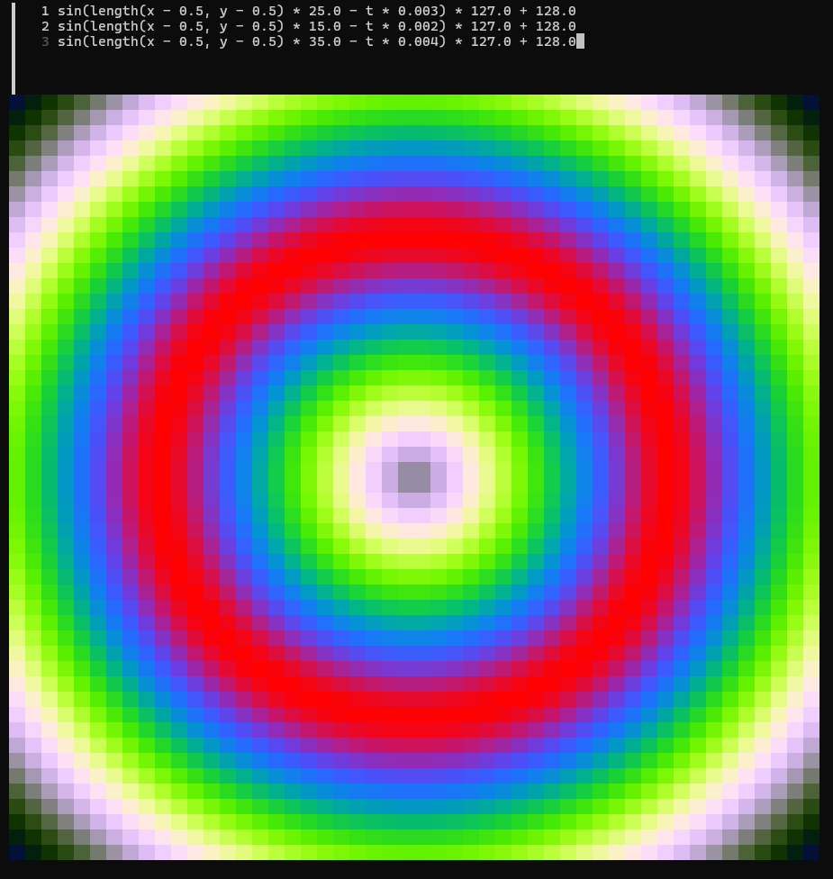

# Shader Editor

A terminal-based live shader editor that allows you to write math expressions that produce RGB color values per pixel, rendered as a 100×100 grid in your terminal using ANSI true-color.




## Requirements

- **Go 1.25+** — [go.dev/dl](https://go.dev/dl/)
- A terminal with true-color support (Windows Terminal, iTerm2, most modern Linux terminals)

### Windows

1. Install Go from [go.dev/dl](https://go.dev/dl/) (the `.msi` installer adds Go to your PATH automatically).
2. Open **Windows Terminal** (or PowerShell).
3. Clone and run:
   ```powershell
   git clone https://github.com/your-username/shadereditor.git
   cd shadereditor
   go run .
   ```

### Linux

1. Install Go:
   ```bash
   # Ubuntu/Debian
   sudo apt update && sudo apt install -y golang-go

   # Or download from go.dev for the latest version
   wget https://go.dev/dl/go1.25.7.linux-amd64.tar.gz
   sudo tar -C /usr/local -xzf go1.25.7.linux-amd64.tar.gz
   export PATH=$PATH:/usr/local/go/bin
   ```
2. Clone and run:
   ```bash
   git clone https://github.com/your-username/shadereditor.git
   cd shadereditor
   go run .
   ```

## Usage

Write three lines of expressions — one per color channel (R, G, B). Press **Ctrl+S** to compile and see the result animate. Press **Ctrl+D** to clear. Press **Ctrl+C** to quit.

## Flags

| Flag | Default | Description |
|------|---------|-------------|
| `-w` | `100` | Grid width in pixels |
| `-h` | `100` | Grid height in pixels |
| `-profile` | `false` | Write CPU profile to `cpu.prof` |
| `-savelogs` | `false` | Save logs to `shader.log` on exit |

```bash
go run . -w 80 -h 60          # custom resolution
go run . -profile              # enable CPU profiling
go run . -savelogs             # save logs on exit
```

## Variables

| Name | Type | Description |
|------|------|-------------|
| `t` | float | Time in milliseconds since start |
| `x` | float | Pixel column (0.0–1.0, left to right) |
| `y` | float | Pixel row (0.0–1.0, bottom to top) |

## Constants

| Name | Value |
|------|-------|
| `PI` | 3.14159... |
| `TAU` | 6.28318... (2π) |
| `E` | 2.71828... |

## Functions

### Trigonometric
| Function | Description |
|----------|-------------|
| `sin(x)` | Sine |
| `cos(x)` | Cosine |
| `tan(x)` | Tangent |
| `atan(x)` | Arctangent |
| `atan2(y, x)` | Two-argument arctangent |

### Power / Exponential / Log
| Function | Description |
|----------|-------------|
| `pow(x, y)` | x raised to the power y |
| `sqrt(x)` | Square root |
| `exp(x)` | e^x |
| `log(x)` | Natural logarithm |
| `log2(x)` | Base-2 logarithm |

### Rounding
| Function | Description |
|----------|-------------|
| `floor(x)` | Round down |
| `ceil(x)` | Round up |
| `round(x)` | Round to nearest |
| `fract(x)` | Fractional part (x - floor(x)) |

### Range / Clamping
| Function | Description |
|----------|-------------|
| `abs(x)` | Absolute value |
| `sign(x)` | Returns -1, 0, or 1 |
| `min(x, y)` | Minimum of two values |
| `max(x, y)` | Maximum of two values |
| `mod(x, y)` | Float modulo |
| `clamp(x, lo, hi)` | Clamp x to [lo, hi] |

### Shader / GLSL-style
| Function | Description |
|----------|-------------|
| `mix(a, b, t)` | Linear interpolation: a*(1-t) + b*t |
| `step(edge, x)` | 0.0 if x < edge, else 1.0 |
| `smoothstep(e0, e1, x)` | Hermite interpolation between e0 and e1 |
| `length(x, y)` | Distance: sqrt(x² + y²) |

## Operators

Standard arithmetic: `+`, `-`, `*`, `/`, `%` (float modulo), `**` or `^` (power), unary `-`

Ternary: `condition ? a : b`

Comparisons: `==`, `!=`, `<`, `>`, `<=`, `>=`, `&&`, `||`

## Examples

**Color pulse:**
```
sin(t * 0.001) * 127.0 + 128.0
sin(t * 0.002) * 127.0 + 128.0
sin(t * 0.003) * 127.0 + 128.0
```

**Ripple from center:**
```
sin(length(x - 0.5, y - 0.5) * 25.0 - t * 0.003) * 127.0 + 128.0
sin(length(x - 0.5, y - 0.5) * 15.0 - t * 0.002) * 127.0 + 128.0
sin(length(x - 0.5, y - 0.5) * 35.0 - t * 0.004) * 127.0 + 128.0
```

**Checkerboard:**
```
mod(floor(x * 10.0) + floor(y * 10.0), 2.0) * 255.0
mod(floor(x * 10.0) + floor(y * 10.0), 2.0) * 128.0
0
```

**Spinning gradient:**
```
fract(atan2(y - 0.5, x - 0.5) / TAU + t * 0.001) * 255.0
fract(atan2(y - 0.5, x - 0.5) / TAU + t * 0.001 + 0.33) * 255.0
fract(atan2(y - 0.5, x - 0.5) / TAU + t * 0.001 + 0.66) * 255.0
```

**Plasma:**
```
sin(x * 15.0 + t * 0.002) * 127.0 + 128.0
sin(y * 15.0 + t * 0.003) * 127.0 + 128.0
sin((x + y) * 10.0 + t * 0.001) * 127.0 + 128.0
```

## Output

Each expression is clamped to 0–255. Division by zero and NaN are treated as 0.
